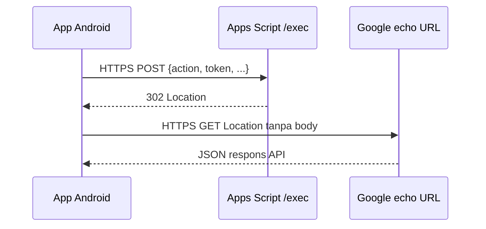

# Arsitektur TSP Modul

## 1. Ringkasan

TSP Modul adalah sistem digitalisasi pencatatan stock RM/PM (raw material/packaging) di
area produksi PANTS, PT Daya Anugrah Mulya. Menggantikan pencatatan manual dengan
mekanisme scan barcode/QR untuk tiap pergerakan material:
WRM → TSP → Mesin → Operator → Consume/Retur → WRM.

Sejak Agustus 2026, sistem ini **dual front-end** di atas satu backend Google Apps Script
& satu Google Sheet yang sama (lihat §12–§13):
- **Web App** (`Index.html` dkk, `doGet`) — dipakai TSP/SPV di komputer/tablet untuk kerjaan
  admin-berat (Material Master, CSV import/export, Reprint label, dsb).
- **App Android** (Flutter, `ApiService.js`/`doPost`) — dipakai operator/TSP di lantai
  produksi untuk scan cepat (kamera live + antrian offline kalau sinyal putus).

Kedua front-end memanggil fungsi bisnis yang **sama persis** (`Code.js` dkk) untuk semua
operasi yang menyentuh database — tidak ada logic PERSISTENSI yang diduplikasi. Khusus
Reprint, app Android hanya membentuk `ReprintRequest` (kode induk, jumlah, mode retur).
`saveBatchReprint_()` di server memvalidasi sisa kuantitas, mengalokasikan barcode anak di
dalam `LockService`, menyimpan batch, lalu mengembalikan label kanonis yang baru boleh
dicetak. Aturan sequence tidak ada di Dart.

## 2. Stack Teknis

- **Backend**: Google Apps Script (runtime V8) — semua logic server-side di file `.js`.
  Dua jalur masuk ke deployment yang sama: `doGet` (HTML, web app) di `Code.js` dan
  `doPost` (JSON API, app Android) di `ApiService.js` — lihat §12.
- **Frontend Web**: `HtmlService` single-page app (`Index.html` + partial `Scanner.html` /
  `Stylesheet.html`), vanilla JS, tanpa framework, komunikasi via `google.script.run`.
- **Frontend Android**: app Flutter native terpisah di `android modif/TSPModul/` (bukan bagian
  dari deployment CLASP) — lihat §13.
- **Database**: Google Sheets, 2 spreadsheet berbeda:
  - Spreadsheet utama **"TSP MODUL"** — ID `1DrwDLaTqqdVwfqNj9hmiPLXmVCzt-rwfR8jgltY5jO8`
  - Spreadsheet **"DATA KARYAWAN"** — ID `14OTl9xYINyRIqnJ2AEaCJFD_D9tNRRueNgFby6FjY9o`,
    dipakai BERSAMA dengan project DT SUMMARY (DAM Portal), khusus untuk autentikasi.
- **Deployment**: CLASP, akun resmi `dayaanugrahmuly4@gmail.com`.
  - Script ID: `1FwO2eOD9kCwYifAD0j8kuJ4hKBR5CAYcRia8yeV1MLgGEJJOGOfKh4QY`
  - Web app access: `ANYONE_ANONYMOUS`, `executeAs: USER_DEPLOYING` — tanpa login Google,
    autentikasi murni NIK+Password sendiri.
  - `npm run deploy` = `docs:build` (regenerate dokumentasi ini) + `clasp push -f` + `clasp deploy`
    ke deployment ID production yang sama, jadi `/exec` selalu ikut ter-update tiap deploy
    (bukan cuma `/dev` seperti `clasp push` polos).
- **Printer produksi**: Tally Dascom DL210, label thermal fisik roll **75x50mm (fixed)** —
  dipakai untuk cetak label Kode Anak/Reprint (lihat §9, Tab Reprint).
- **Library eksternal (CDN)**: `html5-qrcode@2.3.8` (decode barcode dari foto),
  `jsbarcode@3.11.5` (render barcode CODE128 di label reprint),
  `bootstrap-icons@1.11.2`, Google Font `Outfit`.

## 3. Alur Bisnis

```
WRM (gudang) --putaway--> sheet "BARCODE OUTBOUND WRM" (registry pallet, kolom "Kode Unik")
     |
     | TSP pilih No. Reservasi (dari kolom MATDOC RESERVASI di BARCODE OUTBOUND WRM) + scan Kode Unik -> event terima_wrm
     v
Stock TSP (dipegang TSP) --scan Kode Unik yang sama--> event kirim_mesin
     |                          (generate barcode ANAK/kode reprint baru)
     |                                  |
     |                                  v
     |                          Operator scan kode anak -> terima_operator
     |                                  |
     |                       +----------+----------+
     |                       v                     v
     |               consume_operator      retur_dari_mesin (balik ke TSP)
     |                (habis dipakai)              |
     |                                              v
     +<---------------------------------- retur_ke_wrm (MatClaim ke WRM)
```

## 4. Sheet yang Dipakai

| Sheet | Spreadsheet | Peran |
|---|---|---|
| **BARCODE MATERIAL PRODUKSI** | TSP MODUL | Log transaksi utama. 1 baris = 1 unit barcode (induk atau anak), diisi progresif lewat 6 kolom checkpoint (timestamp). |
| **BARCODE OUTBOUND WRM** | TSP MODUL | Registry pallet fisik outbound dari WRM. Sumber lookup MID/Deskripsi/UOM/Qty saat event `terima_wrm`, sekaligus sumber data reservasi via kolom `MATDOC RESERVASI` (menggantikan tab RESERVASI lama). Kolom utama: `Tanggal Outbound`, `Shift`, `MID`, `DESC`, `UOM`, `QTY`, `Supplier`, `Kode Unik`, `MATDOC RESERVASI`. Menyediakan dropdown No. Reservasi dan daftar MID yang diizinkan saat event `terima_wrm`. |
| **REPRINT BARCODE** | TSP MODUL | Log penerbitan Barcode Reprint (Kode Anak) oleh TSP — lewat event `kirim_mesin` **maupun** menu Reprint batch. Sejak v114 kedua jalur menulis ke sini lewat allocator yang sama (`allocateChildBarcodes_`), jadi sheet ini jadi basis perhitungan sisa kuantitas induk. |
| **STOCK TSP** | TSP MODUL | Rekap saldo real-time stok area TSP per MID (30 kolom, termasuk breakdown Kirim/Return per 6 area mesin: BHP 1-5, AHP 1). |
| **STOCK MESIN** | TSP MODUL | Rekap saldo 39 kolom real-time stok 6 area Mesin (BHP 1..5, AHP 1). |
| **MATERIAL MASTER** (`SHEET_NAMES.MATERIAL_MASTER`) | TSP MODUL | Master material aktif (MID, Deskripsi/**MATERIAL DESCRIPTION** — kedua penamaan header diterima, UOM, **Supplier** — kolom ditambahkan otomatis kalau belum ada) — dipakai mengisi tabel Stock supaya semua material master selalu tampil, dan jadi sumber fallback Supplier untuk MID yang belum pernah ada transaksi WRM. Dikelola lewat menu **Material Master → Material List** (lihat §7). |
| **MID EXISTING** *(legacy)* | TSP MODUL | Sheet Material Master versi lama, sudah tidak dibaca langsung oleh kode. Dipertahankan sebagai sumber migrasi sekali-jalan (`migrateMaterialMasterIfEmpty_`) ke sheet **MATERIAL MASTER** di atas — aman dihapus manual setelah dipastikan migrasi berhasil & datanya lengkap. |
| **MIN MAX STOCK** (`SHEET_NAMES.MIN_MAX`) | TSP MODUL | Threshold Min/Max Stock per kombinasi MID + Lokasi (7 kolom: MID, Deskripsi, Lokasi, Min, Max, Updated At, Updated By). Dikelola lewat menu **Material Master → Min/Max Stock** (lihat §7); MID di sheet ini wajib sudah terdaftar di **MATERIAL MASTER**. |
| **MB51** (nama asli `"MB51 "`, ada spasi di akhir) | TSP MODUL | Copy-paste transaksi SAP TCODE MB51. **Hanya validator pembanding**, bukan sumber data utama. |
| **Log Aktivitas Barcode** | TSP MODUL | Audit trail semua percobaan scan (sukses & gagal). |
| **KARYAWAN** | DATA KARYAWAN | Master NIK/Nama/Departemen/Jabatan/Password untuk login. |

Header lengkap sheet "BARCODE MATERIAL PRODUKSI" (`BARCODE_COLUMNS` di `Config.js`):
`TANGGAL, SHIFT, BARCODE, NO RESERVASI, MID, MATERIAL DESCRIPTION, JUMLAH, MESIN, DITERIMA OLEH TSP DARI WRM, DIKIRIM OLEH TSP KE MESIN, RETUR DITARIK OLEH TSP DARI MESIN, DITERIMA OLEH OPERATOR DARI TSP, DICONSUME OLEH OPERATOR, RETUR DIKIRIM KEMBALI OLEH TSP KE WRM`

> **Kolom `MESIN` (v114)** — catatan resmi mesin tujuan tiap barcode anak, dan **satu-satunya sumber
> kebenaran** atribusi mesin. Dikunci saat `kirim_mesin`, diwarisi `consume_operator`/`retur_dari_mesin`
> tanpa input ulang. Sebelum kolom ini ada, client mengirim `mesinCode = null` untuk event operator
> sehingga mutasi STOCK MESIN tidak pernah tercatat dan retur tidak bisa menemukan mesin asal.
> `ensureSheetsReady_()` menambahkan kolom ini otomatis ke sheet lama (di-append di ujung kanan;
> semua akses lewat header-map, jadi posisinya tidak penting). Baris warisan sebelum v114 punya
> `MESIN` kosong — event operator di baris itu menghasilkan **warning**, bukan sukses diam-diam.

## 5. Model Data Barcode (Induk-Anak)

- **Barcode INDUK** = "Kode Unik" asli dari WRM (kode opak, mis. `DTA15M2708199`) —
  mewakili 1 pallet utuh yang diterima TSP. MID/Qty-nya **tidak** ter-encode di teksnya
  sendiri, harus di-lookup dari sheet BARCODE OUTBOUND WRM.
- **Barcode ANAK** = kode reprint yang di-*generate* SISTEM saat event `kirim_mesin` =
  `<KodeIndukAsli>-<urutan 2 digit>` (mis. `DTA15M2708199-01`) — mewakili 1 pecahan qty
  yang dikirim ke 1 mesin tertentu.
- Klasifikasi induk vs anak (`classifyBarcode_` di `BarcodeService.js`): cek pola regex
  suffix `-\d{2}$` **dan** verifikasi bagian sebelum suffix itu terdaftar sebagai baris
  induk yang sudah diterima.
- **Penerbitan barcode anak terpusat (v114)** — hanya `allocateChildBarcodes_()` yang boleh
  menerbitkan Kode Anak. Dipakai bersama oleh jalur scan `kirim_mesin` dan menu Reprint batch,
  di dalam satu `LockService` script lock, dengan empat jaminan: nomor urut + cek duplikat +
  penulisan berada dalam satu bagian kritis; total penerbitan tidak pernah melebihi sisa
  kuantitas induk; barcode anak yang sudah terdaftar ditolak; penulisan REPRINT BARCODE +
  BARCODE MATERIAL PRODUKSI punya rollback kompensasi. Sebelumnya jalur scan menulis dua sheet
  sendiri tanpa lock/cek duplikat/validasi sisa, sehingga dua scan berbarengan bisa memakai
  sequence yang sama dan total kirim bisa melebihi qty induk.
- **Anak tidak boleh beranak (v115)** — `kirim_mesin` menolak barcode yang terklasifikasi sebagai
  Kode Anak. Tanpa penjagaan ini, men-scan Kode Anak menerbitkan "cucu" (`INDUK-01-01`) yang
  menghitung qty dua kali di STOCK TSP dan lolos dari plafon sisa kuantitas induk, karena
  allocator memakai baris anak itu sebagai induk barunya.

## 6. State Machine — 6 Checkpoint

| Event (kode internal) | Kolom checkpoint | Prasyarat | Role | Input tambahan |
|---|---|---|---|---|
| `terima_wrm` | Diterima Oleh TSP dari WRM | — (bikin baris induk baru) | TSP | Pilih No. Reservasi (Filter Tanggal Calendar + Dropdown Unik dari kolom `MATDOC RESERVASI` di BARCODE OUTBOUND WRM + Validasi Cocok MID scan vs daftar MID reservasi) |
| `kirim_mesin` | Dikirim Oleh TSP ke Mesin | `terima_wrm` | TSP | pilih Mesin + isi Jumlah manual |
| `terima_operator` | Diterima Oleh Operator dari TSP | `kirim_mesin` | Operator | **pilih Mesin (wajib sejak v114)** — server menolak kalau kosong, dan menolak kalau berbeda dari kolom `MESIN` yang sudah dikunci TSP |
| `consume_operator` | Diconsume Oleh Operator | `terima_operator` | Operator | tidak ada — mesin diwarisi dari kolom `MESIN` |
| `retur_dari_mesin` | Retur Ditarik Oleh TSP dari Mesin | `kirim_mesin` | TSP | tidak ada — mesin diwarisi dari kolom `MESIN`, fallback `lookupMesinFromLog_` untuk baris warisan |
| `retur_ke_wrm` | Retur Dikirim Kembali Oleh TSP ke WRM | `retur_dari_mesin` | TSP | tidak ada |

**Resolusi mesin (`handleChildCheckpoint_`, sejak v114).** Urutan: mesin yang dikirim client →
kolom `MESIN` di baris barcode → `lookupMesinFromLog_()` (fallback baris warisan). Validasi mesin
berjalan **sebelum** checkpoint ditulis, jadi penolakan tidak pernah meninggalkan checkpoint
setengah tercatat. Kalau mesin dari client berbeda dari kolom `MESIN`, scan ditolak untuk **semua**
event — bukan cuma `terima_operator` — supaya mutasi stok tidak pernah dibebankan ke mesin yang
salah. Kalau mesin tetap tidak ketemu untuk event yang membutuhkannya, hasilnya ditandai
`warning: true` dan **tidak ada mutasi stok yang dikarang**.

> **Catatan alur (bukan bug).** Label dari menu Reprint batch tidak mengisi kolom
> `DIKIRIM OLEH TSP KE MESIN`, jadi prasyarat `terima_operator` belum terpenuhi dan label itu
> belum bisa discan operator. Ini perilaku sejak awal, bukan regresi v114 — belum diputuskan
> apakah label reprint memang murni pengganti label fisik, atau seharusnya bisa masuk alur operator.

## 7. Model Perhitungan Stock & Side Panels (`StockService.js`)

Ledger dihitung ulang **on-the-fly** tiap request:

- **Stock TSP** (per MID) = Σ(Diterima dari WRM) − Σ(Dikirim ke Mesin) + Σ(Retur dari Mesin) − Σ(Retur ke WRM).
- **Stock per Mesin** (39 kolom breakdown 6 area mesin) = Σ(Terima Operator) − Σ(Consume) − Σ(Retur Mesin).
- **Breakdown Keluar/Retur per Mesin**: `computeTspStock_` dan `computeValidator_` mengekspos angka Kirim & Retur+ terpisah per area mesin (BHP 1-5, AHP 1), selain totalnya — dipakai untuk kolom per-mesin di tabel Stock & Validasi (lihat §9).
- **Panel Penerimaan & Pengiriman Shift Ini**:
  - `computeShiftReceipts_`: Menyajikan daftar material yang diterima dari WRM dalam window shift aktif (terurut descending, terbaru di atas).
  - `computeShiftDispatches_`: Menyajikan daftar material/reprint yang dikirim ke mesin dalam window shift aktif (terurut descending, terbaru di atas).
  - Layout (sejak v87): 2 kolom sejajar kiri-kanan **di atas** tabel Stock utama (bukan lagi sticky di sisi kanan) — lihat §9.
- **Ketahanan Sinkronisasi Ledger (`incrementStockCell_`)**: Update sel real-time ke STOCK TSP/STOCK MESIN mensyaratkan baris shift aktif sudah ada (dicetak lewat "Tarik Stok Awal Shift"). Jika baris belum ada, fungsi ini mengembalikan `false` (bukan diam-diam gagal) — `handleTerimaWrm_`, `handleKirimMesin_`, dan `handleChildCheckpoint_` menangkap status ini dan menambahkan peringatan eksplisit ke hasil scan (lihat §9, state "warning") supaya operator/Admin TSP tahu harus Tarik Stok Awal Shift dan verifikasi ulang transaksi tsb, alih-alih kehilangan angka stok tanpa jejak.
- **Menu "Material Master" — 2 sesi terpisah (`MaterialService.js` + `StockService.js`)**: Diakses lewat tab sidebar "Material Master" (role **tsp** & **spv** — sebelumnya spv-only, direname dari "Min/Max Stock"), dengan sub-navigasi 2 sesi yang sengaja tidak dicampur:
  - **Sesi 1 "Material List"** — CRUD murni Material Master (MID, Deskripsi, UOM, Supplier), TANPA konsep lokasi/threshold:
    - `saveMaterialMaster_(nik, mid, deskripsi, uom, supplier)`: insert/update 1 baris. Berbeda dari `upsertMaterialMaster_` versi lama (sudah dihapus) yang cuma mengisi field kosong, fungsi ini **selalu menimpa** field dengan nilai baru — sesuai untuk aksi eksplisit user "Tambah/Edit Material".
    - `saveMaterialBatch_(nik, items)`: import CSV massal (`MID,MATERIAL DESCRIPTION,UOM,SUPPLIER`).
    - `deleteMaterial_(nik, mid)`: hapus material — **ditolak** kalau MID pernah dipakai di transaksi manapun (`isMidUsedAnywhere_` — cek kolom MID di STOCK TSP, STOCK MESIN, BARCODE MATERIAL PRODUKSI, BARCODE OUTBOUND WRM). Kalau berhasil dihapus, **cascade**: seluruh baris MIN MAX STOCK terkait MID itu ikut terhapus (`deleteMaterialMaster_` + cleanup manual di `deleteMaterial_`).
    - `resolveDeskCol_(headerMap)`: helper supaya kolom deskripsi bisa ditulis sebagai header `"Deskripsi"` ATAU `"MATERIAL DESCRIPTION"` (case-insensitive) — kompatibel dengan sheet manapun yang dipakai user.
    - `migrateMaterialMasterIfEmpty_()`: migrasi sekali-jalan dari sheet lama `MID EXISTING` ke sheet baru `MATERIAL MASTER` kalau sheet baru masih kosong. Aman dipanggil berkali-kali (self-limiting), dipanggil otomatis dari `getMaterialListApi()` tiap sesi Material List dibuka.
    - **Aktivasi langsung di shift berjalan (`ensureMidInActiveShift_`, sejak v98)**: normalnya MID baru baru muncul di Stock TSP/Stock Mesin pada shift **berikutnya** (baris stok per shift adalah snapshot yang dicetak sekali oleh `executeShiftRollover_`, tidak re-derive dari Material Master tiap request). `saveMaterialApi`/`saveMaterialBatchApi` (Code.js) sekarang otomatis memanggil `ensureMidInActiveShift_(mid, actorNik, actorNama)` tiap material baru berhasil disimpan — menyisipkan 1 baris baru untuk MID itu ke blok shift AKTIF sekarang (STOCK TSP + STOCK MESIN 6 area, stok awal 0), jadi langsung kepakai TSP maupun Operator tanpa nunggu shift berikutnya. Idempotent (no-op kalau MID sudah ada di shift aktif) dan sengaja no-op juga kalau shift aktif belum pernah ditarik sama sekali (supaya "Tarik Stok Awal Shift" berikutnya tidak keliru mengira shift ini sudah ditarik untuk semua material, yang akan bikin material lain gagal ke-generate).
  - **Sesi 2 "Min/Max Stock"** — threshold per MID + Lokasi, MID **wajib** sudah terdaftar di sesi 1:
    - `saveMinMaxSetting(nik, mid, lokasi, minStock, maxStock)`: **menolak** MID yang belum ada di Material Master (pesan: "Tambahkan dulu di sesi Material List") — beda dari versi lama yang auto-register MID baru secara implisit (sumber percampuran data yang sekarang sengaja dihindari).
    - `saveMinMaxBatch_(nik, items)`: import CSV (`MID,LOKASI,MIN,MAX`) — baris dengan MID belum terdaftar di-skip, dilaporkan di pesan hasil import.
    - `deleteMinMaxSetting_(nik, mid, lokasi)`: hapus 1 baris threshold MID+Lokasi. **Tidak** menyentuh Material Master (beda dari versi awal fitur delete yang sempat cascade-delete ke Material Master — dipisah total begitu Material List jadi sesi sendiri).
  - Input MID di modal "Tambah Min/Max" (sesi 2) pakai `<datalist>` yang di-populate dari data Material List (sesi 1), jadi user cuma bisa pilih MID yang memang sudah valid.
  - **Prioritas Supplier**: `getSupplierMap_()` di-seed dari Supplier default Material Master dulu (fallback), lalu ditimpa oleh Supplier dari histori transaksi `BARCODE OUTBOUND WRM` kalau MID itu sudah pernah punya transaksi — jadi begitu ada transaksi WRM nyata, data itu yang menang.

## 8. Autentikasi (`AuthService.js`)

- Login **NIK+Password** (bukan akun Google), divalidasi ke sheet KARYAWAN.
- Pemetaan Jabatan → role (`JABATAN_ROLE_MAP` di `Config.js`): `"Admin TSP"`/`"TSP"` → `tsp`; `"Operator Production"` → `operator`.
- Role **selalu di-derive ulang server-side** dari NIK di tiap request (`resolveRole_`).
- Lockout brute-force: maksimal 5 percobaan gagal per NIK, lockout 15 menit.

## 9. Struktur UI (`Index.html` & `Scanner.html`)

- **Sidebar Navigasi Responsive**: Layout sidebar 270px dengan flex-row ketat (`flex-direction: row !important`, `flex-wrap: nowrap !important`) & kontainer icon 24px terpusat. Menjamin seluruh menu (`Stock`, `Scan`, `Validasi`, `Riwayat`, `Reprint`, `Material Master`) selalu tampil sejajar horizontal sempurna di semua perangkat (PC, Tablet, dan Mobile/HP) tanpa patah dua baris. `Material Master` tampil untuk role `tsp` & `spv`; `Validasi`/`Reprint` untuk `tsp` & `spv`.
- **Tab "Stock"**: Panel **Penerimaan Shift Ini** & **Pengiriman Shift Ini** (`.stock-shift-panels`, `display:grid` 2 kolom sejajar kiri-kanan — wajib di-set via JS sebagai `'grid'`, bukan `'block'`, karena inline `style.display` selalu menang atas class CSS) tampil **di atas** tabel Stock utama, masing-masing dibatasi tinggi ~4 baris + scroll internal (data terbaru selalu di atas, sudah terurut descending dari backend). Tabel Stock sendiri full-width mengikuti layar (`#tab-stock.tab-panel { max-width: none }`, dikecualikan dari cap 960px yang berlaku default ke tab lain — begitu juga `#tab-validasi`/`#tab-history`/`#tab-minmax`).
  - **Breakdown Keluar/Retur per Mesin**: kolom `Keluar` dan `Retur+` dipecah jadi 6 kolom masing-masing (BHP 1-5, AHP 1) via `buildMesinColumns_()`, jadi tabel Stock (dan Validasi) punya total ~19 kolom.
  - **Kolom Beku (Sticky/Freeze)**: `MID`, `Supplier`, `Material`, `Awal` dibekukan di sisi kiri (`sticky-col`, `left:` offset dihitung dari `width` tiap kolom) sehingga tetap terlihat saat tabel di-scroll ke samping menuju kolom mesin. Sel data kolom `Material` (`td.sticky-col`) **tidak lagi dipotong dengan ellipsis** — teks dibiarkan wrap ke baris berikutnya kalau nama material panjang (header tetap 1 baris karena labelnya selalu pendek).
  - **Scroll universal (`.table-scroll`)**: dipakai bersama oleh `renderTable()`/`renderPortalTable()` untuk tabel Stock, Validasi, Riwayat, dan riwayat kode anak di Reprint — dibatasi `max-height: 68vh` + `overflow: auto` pada kedua sumbu, sehingga scrollbar vertikal & horizontal selalu berada di posisi tetap di tepi frame (tidak perlu scroll halaman dulu untuk bisa scroll ke samping seperti sebelumnya). Panel Penerimaan/Pengiriman override `max-height` jadi lebih kecil (~205px) lewat selector `#recent-receipts-wrap`/`#shift-dispatches-wrap` yang lebih spesifik.
- **Format Angka Presisi (Max 4 Desimal)**: Seluruh perhitungan stok dan render nilai sel tabel diformat secara otomatis menggunakan pembulatan presisi maksimum 4 angka di belakang koma (`formatCellVal`), menghilangkan tail floating point JavaScript (mis. `0.5500000000000007` → `0.55`).
- **Tab "Scan"**: Pilihan event scan. Untuk `terima_wrm`:
  - Widget **HTML5 Date Picker** (`<input type="date">`) dengan nilai default hari berjalan (Today), plus tombol reset **"Semua Tgl"**. Filter berdasarkan kolom `Tanggal Outbound` di BARCODE OUTBOUND WRM.
  - Dropdown **Pilih Nomor Reservasi** yang ter-deduplikasi murni per **Nomor Reservasi Unik** (dari kolom `MATDOC RESERVASI` di BARCODE OUTBOUND WRM, tanpa duplikasi MID material), menampilkan informasi jumlah item material pada masing-masing nomor reservasi.
  - **Panel Informasi Daftar Material (MID) yang Diizinkan**: Kartu hijau interaktif di bawah dropdown yang merincikan daftar seluruh MID, nama barang, dan Qty sesuai nomor reservasi yang dipilih.
  - **Validasi MID Server-side & Client**: Sistem secara otomatis mengawinkan dan mencocokkan MID dari hasil scan barcode (dari `BARCODE OUTBOUND WRM`) vs daftar MID pada nomor reservasi terpilih (kolom `MATDOC RESERVASI`). Jika tidak cocok, transaksi akan ditolak demi mencegah salah kirim material.
  - **3 State Hasil Scan**: kotak hasil scan (`result-box`) punya 3 tampilan — hijau (`result-success`, sukses penuh), merah (`result-error`, gagal/ditolak), dan **kuning/amber** (`result-warning`, scan tercatat TAPI Stock TSP/Mesin belum sinkron karena Tarik Stok Awal Shift belum dilakukan — lihat §7).
- **Tab "Validasi"**: Tabel Masuk (Scan) vs Masuk (MB51 SAP) vs Selisih, plus breakdown Keluar/Retur per mesin yang sama dengan tab Stock (dari data scan, bukan dibandingkan ke MB51 karena MB51 tidak punya data ini). Kolom `MID`/`Supplier`/`Material` juga dibekukan.
- **Tab "Material Master"**: sub-navigasi 2 sesi (lihat §7 untuk detail backend):
  - **Sesi "Material List"**: tabel MID/Deskripsi/UOM/Supplier + tombol Tambah/Edit/Hapus + Template/Upload CSV sendiri. Modal `modal-material-edit`.
  - **Sesi "Min/Max Stock"**: tabel MID/Lokasi/Min/Max/Status + filter Lokasi + tombol Tambah/Edit/Hapus + Template/Upload CSV sendiri (`MID,LOKASI,MIN,MAX`). Modal `modal-minmax-edit`, input MID pakai `<datalist>` yang hanya berisi MID dari Material List (mencegah threshold dibuat untuk MID yang belum terdaftar).
- **Tab "Reprint" — Kalibrasi Cetak Label (Tally Dascom DL210, 75x50mm)**: `applyReprintPageSize_()` menyuntikkan `@page { size: 75mm 50mm; margin: 0 }` ke `<style>` yang di-refresh tiap render label, jadi print dialog browser otomatis menerima ukuran kertas fisik yang benar (sebelumnya tidak ada aturan `@page` sama sekali, selalu fallback ke A4/Letter). Karena roll label printer fisiknya fixed 75x50mm (tidak bisa ganti per print job), preset ukuran **Kecil/Standar/Besar** di modal preview cuma mengatur kepadatan konten (tinggi barcode, ukuran font, padding) di dalam kanvas 75x50mm yang sama — bukan ukuran kertas berbeda-beda. Tiap `.print-label-page` diberi `width`/`height` mm eksplisit + `overflow:hidden` supaya konten tidak pernah meluber keluar batas fisik label.

## 10. Proteksi Pemetaan Kolom (Robust Column Mapping)

Backend TSP Modul dilengkapi mekanisme dinamis multi-lapis untuk membaca tabel data dari Google Sheets. Hal ini dirancang untuk mencegah *error* saat pengguna tidak sengaja melakukan kesalahan pengetikan di baris judul (header) Excel.
- **Space Trimming**: Mengatasi spasi siluman/tambahan di awal atau akhir kata. Saat membaca *header* sheet atau melakukan pencarian data spesifik, sistem selalu mengaktifkan `.trim()` otomatis. (Contoh: `"MID "` di Sheet dijamin akan dikenali secara internal sebagai `"MID"`).
- **Case-Insensitive Mapping**: Mengatasi inkonsistensi huruf kapital (besar/kecil). Fungsi internal `getHeaderMap_` meregistrasi setiap judul kolom ganda, yakni versi asli dan versi huruf kecil paksa (`toLowerCase`). Panggilan kode terhadap `headerMap['JUMLAH']` atau `headerMap['jumlah']` dipastikan 100% tepat mengarah ke kolom yang sama.
- **Fallback Chaining**: Mengatasi penggantian nama kolom atau *typo*. Pencarian kolom krusial diikat menggunakan jaring pengaman berantai (Logika OR `||`). Misalnya, kolom tanggal dicari berurutan: `"Tanggal Outbound"` → `"TANGGAL"` → `"Tanggal"`. Kolom reservasi: `"MATDOC RESERVASI"` → `"NO RESERVASI"` → `"No Reservasi"`.

## 11. Riwayat Deployment (Versi CLASP)

| Versi | Perubahan utama |
|---|---|
| v1–v11 | Base TSP Modul, autentikasi NIK, scan foto, dashboard stock & validator MB51 |
| v12–v13 | Workflow paralel 2 level + 39 kolom STOCK MESIN breakdown 6 area mesin |
| v14–v15 | Tambah side-card **Pengiriman Shift Ini** + Sticky position pada dashboard Stock |
| v16 | Tambah input No. Reservasi + lookup rincian material (MID, Description, Qty) saat `terima_wrm` |
| v17 | Integrasi data reservasi (awalnya dari tab `RESERVASI` terpisah) dengan dropdown selector yang di-filter otomatis berdasarkan Tanggal & Shift aktif |
| v18–v24 | Penanganan tanggal SAP (`MM/DD/YYYY`), HTML5 Calendar Date Picker (default Hari Berjalan), Filter Movement Type SAP, & deduplikasi murni per Nomor Reservasi Unik |
| v25–v26 | Penghapusan filter Movement Type, integrasi validasi & kawin MID hasil scan barcode vs daftar MID Reservasi SAP, smart date parsing (`DD-MMM-YYYY` seperti `31-Jul-2026`, serial Excel, `YYYY-MM-DD`), dan auto-update deployment production web app (`/exec`) via `npm run deploy` |
| v27–v65 | Refactoring tab data ke `BARCODE OUTBOUND WRM` untuk mapping Supplier per MID, penambahan kolom MID & Supplier pada tabel stok, pembatasan format angka max 4 desimal (`formatCellVal`), dan perbaikan desain sidebar navigasi responsive sejajar flex-row. |
| v66–v80 | **Konsolidasi data reservasi**: tab `RESERVASI` dihapus, seluruh data reservasi terintegrasi ke `BARCODE OUTBOUND WRM` (kolom `MATDOC RESERVASI`). Column mapping diupdate: `Tanggal Outbound`, `DESC`, `QTY`, `UOM`, `Shift`. Lookup MID di-fix (trailing space). Single source of truth untuk lookup Kode Unik + reservasi. |
| v81 | Penambahan kolom **MID**, **Supplier**, dan **Material Description** ke seluruh UI Table jenis apapun (Penerimaan, Pengiriman, Validasi Fisik, dan Pengaturan Min/Max Stock SPV). Data Supplier di-join secara terpusat melalui fungsi backend `getSupplierMap_()` bersumber dari `WRM_INCOMING`. |
| v83 | Breakdown kolom **Keluar** & **Retur+** per area mesin (BHP 1-5, AHP 1) di tabel Stock & Validasi (`computeTspStock_`, `computeValidator_`, `buildMesinColumns_`). |
| v84 | Kolom **MID/Supplier/Material/Awal** dibekukan (sticky/freeze) di sisi kiri tabel Stock & Validasi saat scroll horizontal ke kolom mesin. |
| v85 | **Perbaikan kritis**: `incrementStockCell_` yang sebelumnya diam-diam gagal (silent no-op) menulis ke STOCK TSP/STOCK MESIN saat baris shift aktif belum ada (mis. Tarik Stok Awal Shift belum dilakukan) sekarang mengembalikan status sukses/gagal; hasil scan menampilkan peringatan eksplisit (state "warning" kuning) bila stok gagal sinkron, alih-alih kehilangan data secara diam-diam. |
| v86 | Perbaikan bug scroll horizontal di level halaman (`.stock-layout` grid `2fr 1fr` → `minmax(0, 2fr) minmax(0, 1fr)`, `body { overflow-x: hidden }`, `.app-content { min-width: 0 }`) yang sebelumnya membuat kolom sticky (v84) tidak berfungsi karena seluruh halaman ikut ter-scroll, bukan hanya tabel. |
| v87 | Sync ~9 hari pekerjaan lokal yang sempat tertahan (barcode scan, form No. Reservasi, filter Movement Type, dll.) + rearrange layout Stock: panel Penerimaan/Pengiriman dipindah ke atas tabel, frame tabel Stock dibuat full-width dengan scroll internal. |
| v88–v90 | Perbaikan panel Penerimaan/Pengiriman: root cause stack vertikal ternyata `style.display` inline di-set `'block'` oleh JS (menang atas `display:grid` di CSS) — diganti `'grid'`. Kolom Material di tabel Stock/Validasi tidak lagi dipotong ellipsis (`td.sticky-col` boleh wrap). |
| v91 | `.tab-panel` yang sebelumnya dibatasi `max-width: 960px` secara default (cuma `#tab-stock` dikecualikan) sekarang juga dikecualikan untuk `#tab-validasi`/`#tab-history`/`#tab-minmax` — tabelnya jadi full-width mengikuti layar, bukan cuma separuh. |
| v92 | *(superseded v94)* Tombol shortcut "+ Tambah Material" sempat ditambahkan di tab Stock supaya role `tsp` bisa daftar material tanpa akses tab Min/Max Stock (yang saat itu masih spv-only) — dihapus lagi di v94 setelah menu direname jadi Material Master & dibuka untuk role `tsp`. |
| v93 | Tombol **Hapus** di tabel Min/Max Stock (sebelumnya cuma ada Edit) — hapus MID+Lokasi tertentu; kalau MID itu tidak punya lokasi lain & belum pernah dipakai di transaksi, MID-nya ikut hilang dari Material Master (perilaku ini disederhanakan lagi di v95). |
| v94 | Tab "Min/Max Stock" di-rename jadi **"Material Master"**, dibuka untuk role `tsp` (sebelumnya spv-only) — akar masalah kenapa Admin TSP tidak bisa tambah/hapus material sendiri. |
| v95 | **Konsolidasi jadi 2 sesi terpisah** ("jangan dicampur aduk"): Material List (MID/Deskripsi/UOM/Supplier) vs Min/Max Stock (MID+Lokasi+Min+Max), masing-masing dengan toolbar & CSV sendiri. `saveMinMaxSetting` sekarang menolak MID yang belum terdaftar; `deleteMinMaxSetting_` disederhanakan jadi murni hapus threshold, tidak lagi cascade ke Material Master (lihat §7). |
| v96 | Sumber Material Master dipindah dari sheet lama `MID EXISTING` ke sheet baru `MATERIAL MASTER` (dibuat manual oleh user) + migrasi otomatis sekali-jalan (`migrateMaterialMasterIfEmpty_`) supaya data lama tidak hilang. `resolveDeskCol_` bikin kode kompatibel dengan header `"Deskripsi"` maupun `"MATERIAL DESCRIPTION"`. |
| v97 | Kalibrasi cetak label Reprint untuk printer produksi Tally Dascom DL210 (label thermal 75x50mm) — `@page` CSS baru di-set programatik via `applyReprintPageSize_()` supaya print dialog otomatis pas ukuran kertas fisik, alih-alih fallback ke A4/Letter seperti sebelumnya. |
| v98 | Material baru langsung aktif di shift berjalan (`ensureMidInActiveShift_`), tidak perlu tunggu "Tarik Stok Awal Shift" shift berikutnya lagi — dipanggil otomatis dari `saveMaterialApi`/`saveMaterialBatchApi` tiap material baru tersimpan (lihat §7). |
| v99 | Tambah `ApiService.js` (`doPost`) — JSON API layer untuk app Android, additive murni, tidak mengubah satu pun fungsi/perilaku yang dipakai web app (`doGet`). Lihat §12. |
| v100 | **[SECURITY]** Ditemukan lewat audit eksternal: `tarikStokAwalShift`/`konfirmasiNeracaStokShift`/`konfirmasiItemStokShift` diam-diam lanjut eksekusi pakai actor fallback walau `resolveRole_()` gagal (NIK invalid tidak menghalangi aksi Admin TSP); endpoint tulis Material Master/Min-Max/Reprint sama sekali tidak mengecek role. Fix: `requireRole_(nik, allowedRoles)` baru di `AuthService.js`, diterapkan ke 11 endpoint tulis di `Code.js` (dipakai bareng web app & `ApiService.js`, jadi 1 gerbang otorisasi utk kedua front-end). `saveBatchReprint`/`deleteReprintBarcode` yang sebelumnya tidak menerima `nik` sama sekali sekarang wajib. |
| v101–v113 | *(tidak terdokumentasi)* — deployment antara v100 dan v114 tidak tercatat di tabel ini. Untuk menelusuri perubahannya, pakai `git log` pada rentang commit terkait, bukan tabel ini. |
| v114 | **Konsistensi workflow barcode (audit internal).** (1) **Kolom `MESIN` baru** di BARCODE MATERIAL PRODUKSI + `terima_operator` wajib mesin — sebelumnya `requiresMesin:false` bikin client kirim `null`, mutasi STOCK MESIN tidak pernah tercatat, dan retur tidak bisa menemukan mesin asal; mesin yang tidak terselesaikan sekarang jadi warning eksplisit, bukan sukses diam-diam. (2) **`allocateChildBarcodes_()`** — allocator terkunci tunggal yang dipakai bersama `handleKirimMesin_` dan `saveBatchReprint_`; menutup celah barcode anak ganda & total kirim melebihi qty induk pada jalur scan yang dulu tanpa lock. (3) **Rollback kompensasi** pada penulisan REPRINT BARCODE + BARCODE MATERIAL PRODUKSI. (4) **Kontrak respons `submitScan` diperbaiki** — `warning` dan `childBarcode` sebelumnya dibuang/selalu `null`, membuat UI warning kuning & tampilan Kode Reprint di web/Android jadi kode mati. (5) Kolom Mesin di Log Aktivitas memakai mesin hasil resolusi server. (6) **Override hapus paksa SPV di Android** (sebelumnya cuma ada di web). (7) `lookupMesinFromLog_` tidak lagi membaca 500 baris tetap yang melempar error kalau sheet log lebih pendek. |
| v115 | **`kirim_mesin` menolak Kode Anak.** `handleKirimMesin_` tidak pernah memakai `classifyBarcode_`, jadi men-scan barcode anak menerbitkan "cucu" (`INDUK-01-01`): qty dihitung dua kali di STOCK TSP dan penerbitannya lolos dari plafon sisa kuantitas induk (terbukti pada probe — induk qty 100 tetap tercatat terpakai 40 walau cucu 10 sudah terbit). |

## 12. JSON API untuk App Android (`ApiService.js`)

Dibuat additive di file terpisah — tidak satu pun fungsi di `Code.js`/`AuthService.js`/dkk
yang diubah untuk mendukung ini. Prinsipnya: `doPost(e)` murni jadi **transport JSON** di
atas fungsi publik `Code.js` yang sama persis dipakai `google.script.run` oleh web app,
supaya tidak ada logic bisnis yang terduplikasi/berisiko divergen.

- **Routing**: `doGet` (di `Code.js`, tidak diubah) tetap melayani HTML web app. `doPost`
  (di `ApiService.js`) khusus jalur JSON — dipanggil app Android lewat HTTP POST ke URL
  `/exec` yang sama. Tidak ada konflik karena beda HTTP method.
- **Auth token-based** (`apiLogin_`, `validateApiToken_`): app Android login sekali dapat
  token (bukan kirim ulang NIK+password tiap request). Token disimpan di
  `CacheService` dengan **sliding-window TTL 6 jam** (batas maksimum CacheService Apps
  Script) — direfresh tiap request valid, supaya sesi aktif tidak habis di tengah shift.
  Role **selalu** diverifikasi ulang dari sheet KARYAWAN lewat `resolveRole_()` yang sama
  dipakai `submitScan` — token tidak pernah dipercaya membawa klaim role sendiri.
- **Idempotency** (`apiSubmitScanIdempotent_`): khusus action `submitScan`, client Android
  mengirim `clientRequestId` (UUID per scan). Kalau request dengan id yang sama pernah
  sukses diproses (mis. respons hilang karena koneksi putus saat sinkronisasi offline),
  server mengembalikan hasil yang sudah tercatat dari `CacheService` (TTL 2 jam) TANPA
  memanggil `submitScan()` lagi — mencegah dobel-scan/dobel-reprint/dobel log saat app
  Android retry otomatis (lihat §13, antrian offline).
- **Dispatch table** (`API_ACTIONS_`): peta `action` string → fungsi `Code.js` yang sudah
  ada, 1:1 nama dengan yang dipakai `google.script.run` di web app (`submitScan`,
  `getTspStock`, `getReprintData`, `saveMaterialApi`, dst). Aksi tulis (`submitScan`,
  `tarikStokAwalShift`, `konfirmasiNeracaStokShift`, `konfirmasiItemStokShift`,
  `saveMaterial*`, `saveMinMax*`, `deleteMaterial*`, `deleteMinMax*`) pakai NIK dari
  **token yang terverifikasi** (`session.nik`), bukan NIK kiriman client — lebih ketat
  dari jalur `google.script.run` lama yang percaya parameter `nik` dari client.
- **Revalidasi sesi bootstrap** (`getSession`): app meminta identitas sesi yang telah
  diverifikasi server sebelum membuka route berhak akses. Respons hanya berasal dari
  `session` hasil `validateApiToken_`; NIK/role dari storage atau parameter client tidak
  dipakai sebagai sumber otoritas.
- **Alokasi Reprint di server** (`saveBatchReprint_`): Android mengirim `ReprintRequest`
  yang hanya berisi induk, jumlah, dan mode retur. Di dalam `LockService` server menghitung
  sisa kuantitas, menghasilkan barcode anak kanonis, mencegah tabrakan sequence, dan
  mengembalikan label yang benar-benar disimpan. App menampilkan draf tanpa nomor barcode
  sebelum respons dan hanya mencetak label respons server.
- **Kuirk redirect Apps Script**: endpoint `/exec` selalu membalas HTTP 302 ke URL "echo"
  satu-pakai (`script.googleusercontent.com/macros/echo?...`) — POST diproses di hop
  pertama, hasil JSON baru bisa diambil lewat **GET biasa tanpa body** ke Location itu.
  Client Android (Dio) tidak auto-follow redirect untuk POST (beda dari asumsi awal yang
  cuma divalidasi via `curl`) — di-follow manual di `ApiClient._raw()`. Status 301/302/303/
  307/308 diperiksa eksplisit, karena `Response.isRedirect` tidak konsisten pada adapter
  Dio yang memakai `followRedirects: false` (lihat §13).
- **Kontrak transport Android (wajib dipertahankan)**: `ApiClient` memakai DNS/socket
  bawaan Android/Dart; alamat IPv4 atau IPv6 dipilih oleh jaringan, tanpa IP hardcode atau
  pemaksaan satu keluarga alamat. Semua trafik ke Apps Script memakai HTTPS port 443 dan
  HTTP/1.1 dengan validasi TLS normal (tanpa bypass sertifikat, proxy custom, atau
  `badCertificateCallback`). Batas waktu: connect/send 20 detik, receive 30 detik,
  socket idle 15 detik. Timeout/kegagalan koneksi scan masuk `PendingScans` dan hanya
  disinkronkan ulang berurutan dengan `clientRequestId` yang idempotent.

## 13. App Android (Flutter, `android modif/TSPModul/`)

Native app terpisah dari deployment CLASP (bukan bagian `Active/`, tidak ikut ter-push
`clasp push`). Dipakai operator/TSP di lantai produksi sebagai pengganti scan-lewat-foto
di web app. Full parity 9 area fitur web app, ditambah kemampuan yang web app tidak punya
(live camera scan, antrian offline, auto-update).

### 13.1 Stack Teknis

| Lapisan | Pilihan | Alasan |
|---|---|---|
| State management | Riverpod | provider-based, testable |
| HTTP client | Dio | perlu kontrol redirect manual (lihat §12) |
| Resolver koneksi | `dart:io` `HttpClient` standar | DNS dan koneksi dual-stack IPv4/IPv6 dari platform; HTTPS HTTP/1.1 kompatibel dengan Apps Script |
| Database lokal | Drift (SQLite) | antrian scan offline + cache |
| Barcode scan | `mobile_scanner` (ML Kit) | live camera, ganti trik jepret-foto `html5-qrcode` di web |
| Kredensial tersimpan | `flutter_secure_storage` | silent re-login saat token API kadaluarsa |
| Deteksi & sync offline | `connectivity_plus` + `workmanager` | sync foreground instan + jaring pengaman background 15 menit |
| Import CSV | `file_picker` + `csv` | Material Master & Min/Max, fuzzy header-matching sama persis dgn `processMaterialCsvContent`/`processMinMaxCsvContent` di Index.html |
| Cetak label | `pdf` + `printing` + `barcode` | render label 75×50mm (sama ukuran fisik §2) → Android Print Framework, ganti `window.print()` browser |
| Routing | `go_router` | role-gating navigasi, mirror `tab-btn-*` display rule di Index.html |
| Auto-update | GitHub Releases API + `package_info_plus` + `open_filex` | lihat §13.4 |

### 13.2 Fitur (mirror 9 area web app)

1. **Login** — NIK+password, sesi token (§12) + silent re-login.
2. **Scan** — event picker per-role → field pendukung (No. Reservasi dgn fallback manual,
   Mesin, Jumlah) → kamera live scan → hasil. **Antrian offline**: scan yang gagal kirim
   krn tidak ada koneksi otomatis masuk `PendingScans` (Drift), disinkronkan **berurutan**
   (bukan paralel — wajib, krn state machine §6 menolak event lanjutan kalau prasyaratnya
   utk barcode yang sama belum tercatat), idempotent lewat `clientRequestId` (§12).
3. **Stock/Dashboard** — Stock TSP, Monitoring 6 Mesin, Penerimaan/Pengiriman Shift (role
   tsp/spv); Stock Mesin + Terima/Consume per mesin terpilih (role operator).
4. **Admin Shift** — Tarik Stok Awal, Konfirmasi Neraca/Item (role `tsp` khusus, mirror
   "Aksi resmi Admin TSP" — spv cuma bisa lihat, tidak bisa eksekusi).
5. **Riwayat** — Stock TSP/Mesin historis + Portal per jam.
6. **Reprint** — cari Kode Induk → kirim permintaan jumlah/mode retur → server mengalokasikan
   barcode anak dan kuantitas kanonis di dalam lock → app mencetak label respons server sebagai
   PDF 75×50mm via Android Print Framework (printer lapangan: Tally Dascom DL210, §2).
7. **Material Master & Min/Max** — CRUD + import CSV (export/template belum dibuat, lihat
   §13.5).
8. **Validasi vs MB51** — read-only, role tsp/spv.
9. Role-gating nav: `tsp`/`spv` dapat 6 menu (Scan/Stock/Riwayat/Reprint/Material/
   Validasi), `operator` dapat 3 (Scan/Stock/Riwayat) — mirror `tab-btn-*` display rule.

### 13.3 Release Signing

Ditandatangani release keystore (`tsp_modul_release.jks`) — **disimpan di luar repo**
(`C:/Users/imann/keystores/tsp_modul/` di mesin dev, tidak pernah masuk git; `key.properties`
digitignore di `android/.gitignore`). Wajib pakai keystore yang sama tiap build supaya
update APK bisa menimpa instalasi lama tanpa uninstall — kalau keystore ini hilang, semua
update ke depan butuh uninstall-reinstall manual di tiap HP.

### 13.4 Auto-Update (GitHub Releases)

App cek update **diam-diam tiap dibuka** (sekali per sesi) + tombol manual "Cek Update" di
AppBar layar Scan:
1. `core/update_checker.dart` — `GET api.github.com/repos/imannurchaedi-max/TSP/releases/latest`
   (repo publik, tanpa token), bandingkan `tag_name` (semver numerik per-segmen) vs versi
   terpasang (`package_info_plus`). Silent-fail kalau offline/gagal cek.
2. Kalau ada versi lebih baru → dialog changelog (dari `body` release) → user konfirmasi →
   `core/apk_installer.dart` download APK asset via Dio → `open_filex` buka installer
   sistem Android (butuh permission `REQUEST_INSTALL_PACKAGES`).
3. Rilis baru dibuat manual: bump `pubspec.yaml` → jalankan `BUILD_RELEASE_LOCAL.cmd` dari
   checkout Android → git tag `vX.Y.Z` → `gh release create vX.Y.Z
   "build/.../TSP Modul-vX.Y.Z.apk"`. Launcher membangun di `C:\BuildWorkspaces\TSPModul` lalu
   menyalin APK final kembali ke SynologyDrive dalam **dua nama**: `app-release.apk` (nama
   teknis tetap, dipakai tooling internal) dan `TSP Modul-vX.Y.Z.apk` (nama distribusi/user-
   facing, sejak v1.0.5) — **hanya file bernama "TSP Modul-..."** yang boleh di-attach ke
   `gh release create`, karena `update_checker.dart` mengambil asset `.apk` **pertama** yang
   ditemukan di rilis (`assets.where(...).first`) — attach 2 APK ke 1 rilis bikin pilihannya
   ambigu. Jangan jalankan build release langsung di folder yang tersinkron.

| Versi | Perubahan |
|---|---|
| v1.0.0 | Rilis pertama — full parity 9 area + antrian offline + auto-update. |
| v1.0.1 | Fix `android:label` (tampil "tsp_modul" bukan "TSP Modul" di bawah ikon HP). |
| v1.0.2 | **Fix kritis**: login selalu gagal ("Respons server tidak dikenali HTTP 302") — Dio tidak auto-follow redirect Apps Script utk POST (lihat §12, kuirk redirect). Ditemukan saat testing pertama di HP fisik. |
| v1.0.3 | **Fix keamanan**: router (`app_router.dart`) sekarang menolak navigasi ke route tsp/spv-only (`/reprint`, `/material`, `/validator`) kalau role user bukan `tsp`/`spv` — defense-in-depth menyusul fix `requireRole_()` di server (§12, v100 CLASP). Ditemukan lewat audit eksternal. |
| v1.0.4 | App icon Android diganti jadi icon TSP (generate semua mipmap density + adaptive icon via `flutter_launcher_icons`), tambah footer branding logo DAM (PT Daya Anugrah Mulya) & WINGS di layar Login. Sumber gambar di `logo/` (root repo), dicopy ke `assets/branding/` utk di-bundle. |
| Unreleased | Perbaikan koneksi Apps Script: redirect 302 ditangani eksplisit, resolver kembali dual-stack IPv4/IPv6, dan ditambah tes probe redirect. Bootstrap me-revalidasi sesi server; alokasi reprint menjadi otoritatif di server. Workflow release dipindahkan ke workspace lokal agar artefak native Gradle tidak bentrok dengan reparse point SynologyDrive. |

### 13.5 Workflow Koneksi dan Release




`BUILD_RELEASE_LOCAL.cmd` adalah entry point wajib untuk release. Cache Gradle global juga
mematikan file-system watcher (`org.gradle.vfs.watch=false`), tetapi isolasi workspace lokal
adalah perlindungan utama terhadap reparse point SynologyDrive.

### 13.6 Keterbatasan Diketahui

- CSV **export**/template-download belum dibuat (cuma **import**) — beda dari web app yang
  punya keduanya.
- Belum ada test fisik alur offline-queue penuh (airplane mode → scan → online → cek urutan
  sync) di device sungguhan.
- Repo `android modif/TSPModul/` scaffold default `flutter create` mencakup platform lain (iOS/
  Linux/macOS/Windows/Web) yang tidak dipakai — sengaja dibiarkan (opsi ekspansi cross-platform
  di masa depan), tidak menambah beban maintenance karena tidak di-build/di-deploy.
- Penomoran dan kuantitas reprint sekarang diotorisasi server, tetapi perlu uji integrasi
  multi-user pada spreadsheet produksi untuk memverifikasi lock dan sisa kuantitas di bawah
  beban nyata.
- Coverage test masih terbatas: ada widget smoke test dan probe redirect Apps Script dengan
  kredensial dummy. Fitur berisiko lain (antrian offline, sinkronisasi background, dan
  role-gating lintas route) belum punya test otomatis menyeluruh.
- Build release bergantung pada launcher workspace lokal. `BUILD_RELEASE_LOCAL.cmd` wajib
  dipakai selama checkout berada di SynologyDrive; direct build di checkout tidak didukung.
