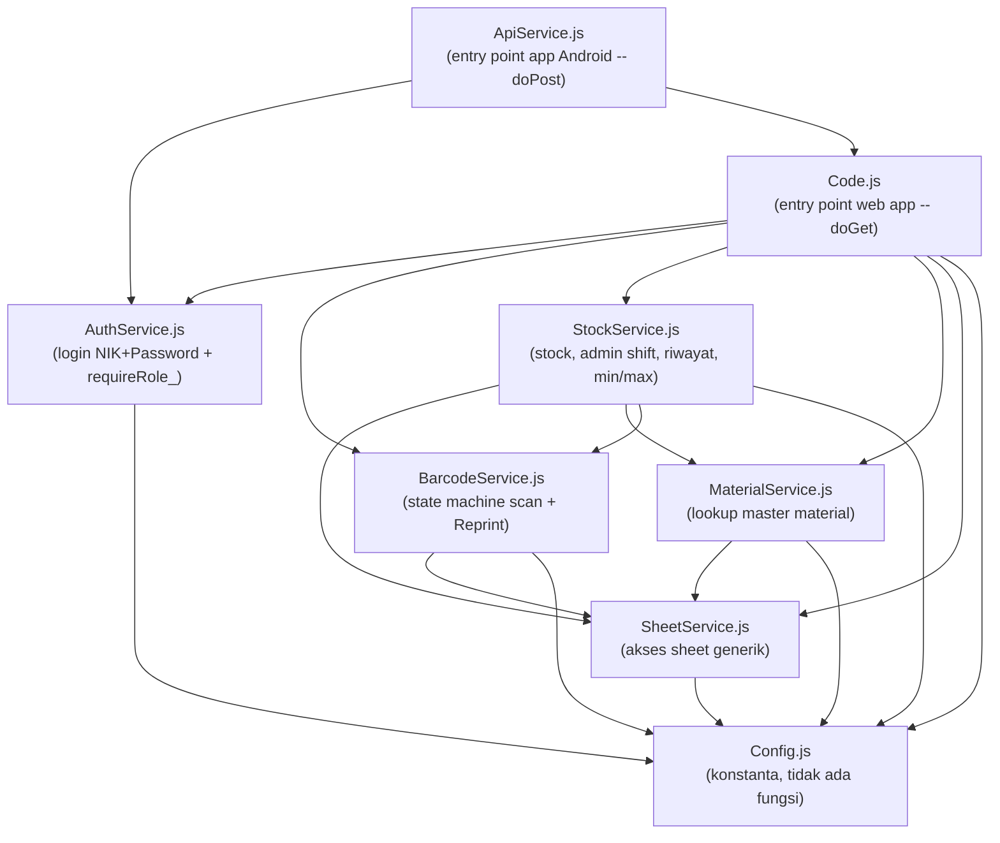
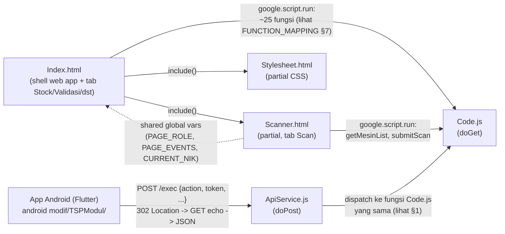
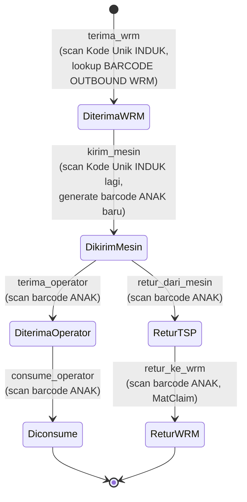
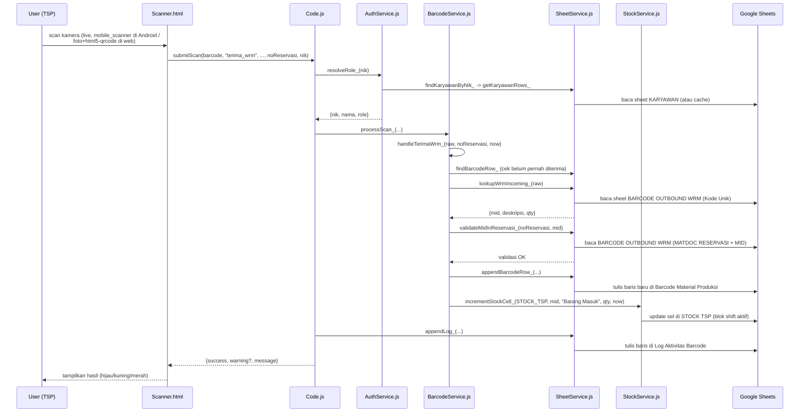

# Dependency Map — TSP Modul

Peta jaringan ketergantungan (siapa memanggil siapa) antar file & fungsi. Apps Script tidak
punya module/import system — semua file `.js` server-side berbagi 1 namespace global, jadi
"dependency" di sini berarti **relasi pemanggilan fungsi**, bukan `import`/`require`.

> Untuk detail per-fungsi (parameter, calls, called by) lihat **`FUNCTION_MAPPING.md`** —
> dokumen itu jadi sumber kebenaran untuk relasi level-fungsi (diverifikasi langsung
> terhadap `grep -n "^function "` tiap kali diupdate). Dokumen ini fokus ke gambaran
> besar (layer, graf antar file, alur end-to-end) supaya tidak menduplikasi & berisiko
> divergen dari `FUNCTION_MAPPING.md` seperti yang sempat terjadi sebelumnya (lihat §6).

## 1. Graf Ketergantungan Antar File (Server-Side)



**Urutan lapisan (dari paling dasar ke paling atas):**
1. `Config.js` — konstanta murni, tidak bergantung ke file lain.
2. `SheetService.js` — bergantung ke `Config.js` (nama sheet, kolom).
3. `MaterialService.js`, `AuthService.js` — bergantung ke `SheetService.js`/`Config.js`.
4. `BarcodeService.js` — bergantung ke `SheetService.js`, `Config.js` (state machine EVENTS),
   juga berisi modul Reprint (`getReprintData_`, `saveBatchReprint_`, `deleteReprintBarcode_`).
   Sejak v114 penerbitan Kode Anak dipusatkan di `allocateChildBarcodes_()`: jalur scan
   (`handleKirimMesin_`) dan jalur Reprint batch (`saveBatchReprint_`) sama-sama memanggilnya,
   jadi relasi keduanya ke `SheetService.js` sekarang **tidak langsung** — lewat allocator itu,
   bukan lagi `appendBarcodeRow_`/`appendReprintRow_` masing-masing.
5. `StockService.js` — **paling banyak dependensi**: `SheetService.js`, `MaterialService.js`
   (`getMaterialMap_`), `BarcodeService.js` (`getShiftBounds_`), `Config.js`. Juga tempat
   logic Admin Shift (`tarikStokAwalShift_`, `konfirmasiStokShift_`, dst) dan Riwayat/History.
6. `Code.js` — lapisan orkestrasi utk **web app**: entry point (`doGet` + fungsi tanpa `_`)
   yang dipanggil `google.script.run`.
7. `ApiService.js` — lapisan orkestrasi utk **app Android**: entry point (`doPost`) yang
   TIDAK menduplikasi logic bisnis — dia manggil ulang fungsi `Code.js` yang sama persis
   dengan `session.nik` hasil verifikasi token (lihat §12 di `ARSITEKTUR.md`).

## 2. Graf Ketergantungan Client ↔ Server (Dual Front-End)



`Index.html` dan `Scanner.html` dirender jadi **satu dokumen HTML** (lewat `include()`
di `Code.js`), sehingga berbagi 1 scope JavaScript — variabel global yang di-set di
`Index.html` (`PAGE_ROLE`, `PAGE_EVENTS`, `CURRENT_NIK`) langsung terbaca oleh fungsi di
`Scanner.html` tanpa mekanisme passing eksplisit.

App Android tidak pernah memanggil `Code.js` langsung — selalu lewat `ApiService.js`
(`doPost`) yang mem-verifikasi token dulu, baru mendispatch ke fungsi `Code.js` yang
identik dengan yang dipanggil web app.

## 3. State Machine — Transisi 6 Checkpoint (per 1 barcode)



Catatan: `retur_dari_mesin` prasyaratnya `kirim_mesin` (bukan `terima_operator`), jadi
secara teknis bisa terjadi sebelum ATAU sesudah `terima_operator`/`consume_operator` —
diagram di atas menyederhanakan jadi 1 cabang dari `DikirimMesin` untuk keterbacaan.

Setiap transisi checkpoint (kecuali `terima_wrm`) juga memicu `incrementStockCell_()` ke
sheet STOCK TSP dan/atau STOCK MESIN (lihat §4) — kalau baris shift aktif belum ada
(Tarik Stok Awal Shift belum dilakukan), fungsi itu return `false` dan hasil scan
menampilkan warning eksplisit, bukan diam-diam kehilangan angka stok.

## 4. Alur Panggilan — Kasus "Scan Terima dari WRM"



## 5. Alur Panggilan — Kasus "Load Tab Stock" (role TSP)

```mermaid
sequenceDiagram
  participant U as User (TSP/SPV)
  participant Client as Index.html / App Android
  participant Entry as Code.js / ApiService.js
  participant Stock as StockService.js
  participant Material as MaterialService.js
  participant GS as Google Sheets

  U->>Client: buka tab/layar "Stock"
  Client->>Entry: getTspStock()
  Entry->>Stock: computeTspStock_(now)
  Stock->>GS: baca LANGSUNG dari sheet STOCK TSP (bukan hitung ulang<br/>dari Barcode Material Produksi -- ledger sudah live-updated<br/>oleh incrementStockCell_ tiap scan, lihat §4)
  Stock->>Material: getSupplierMap_()
  Material->>GS: baca BARCODE OUTBOUND WRM (fallback: Material Master)
  alt sheet STOCK TSP kosong (belum pernah ditarik)
    Stock->>Material: getMaterialMap_() -- fallback tampilkan semua<br/>material master dgn stok 0
    Material->>GS: baca sheet MATERIAL MASTER
  end
  Stock-->>Entry: {shift, date, statusNeraca, validatorNama, rows[]}
  Entry-->>Client: {success, data}
  Client->>Client: render tabel Stock (web: renderTable();<br/>Android: ListView Flutter)
  Client-->>U: tabel Stock tampil
```

> **Koreksi dari versi dokumen sebelumnya**: diagram ini sempat menyebut alur baca dari
> sheet "MID EXISTING" lewat fungsi `seedAccFromMaterialMap_`/`bucketAdd_` yang **sudah
> tidak ada** di kode saat ini. `computeTspStock_` sekarang membaca ledger **STOCK TSP**
> langsung (ditulis real-time oleh `incrementStockCell_` tiap scan), dan sumber material
> master-nya adalah sheet **MATERIAL MASTER** (bukan `MID EXISTING`, yang sudah jadi
> sheet legacy sejak migrasi — lihat §3 `ARSITEKTUR.md`).

## 6. Adjacency List Lengkap & Graf Auto-Generated

Adjacency list manual (fungsi → daftar fungsi yang dipanggil) yang sebelumnya ada di sini
**dihapus** karena berisiko besar jadi stale lagi persis seperti yang ditemukan lewat audit
Agustus 2026 (masih menyebut fungsi yang sudah dihapus: `upsertMaterialMaster_`,
`lookupMaterial_`, `seedAccFromMaterialMap_`, `bucketAdd_`, `computeRecentReceipts_`,
`computeMesinStockBreakdown_`, `getRecentReceipts`). Dua sumber ini dipertahankan sebagai
gantinya, masing-masing dgn mekanisme anti-stale sendiri:

- **`FUNCTION_MAPPING.md`** (kolom "Calls"/"Called by" tiap fungsi) — manual tapi
  diverifikasi terhadap `grep -n "^function " Active/*.js` tiap kali diupdate.
- **`dokumentasi/code_graph.json` / `code_graph.mmd`** — auto-generated oleh
  `tools/graphify_codebase.py`, jalan otomatis tiap `npm run deploy` (via `docs:build`),
  jadi TIDAK PERNAH stale relatif terhadap `Active/*.js` versi yang di-deploy. Catatan:
  graf ini granularitasnya **file → function** (bukan function → function), dan hanya
  memindai `Active/*.js` (tidak mencakup `android modif/TSPModul/`, karena app Android bukan
  bagian deployment CLASP) — pelengkap, bukan pengganti, `FUNCTION_MAPPING.md`.

## 7. Fungsi "Akar" vs "Daun" vs "Hub"

- **Akar panggilan (entry point, dipanggil client)**: semua fungsi tanpa `_` di `Code.js`
  (~25 fungsi, lihat `FUNCTION_MAPPING.md` §7) dan `doPost` di `ApiService.js` (yang lalu
  mendispatch ke fungsi `Code.js` yang sama).
- **Daun (tidak memanggil fungsi lain, operasi dasar)**: `getSpreadsheet_`, `toDateOrNull_`,
  `padSeq_`, `formatDateLabel_`, `getLoginAttemptCount_`, `clearLoginAttempts_`,
  `roleFromJabatan_`, `normalizeMid_`, `parseMb51Timestamp_`.
- **Fungsi "hub"** (dipanggil dari banyak tempat, paling kritikal kalau berubah):
  `getSheet_` & `getHeaderMap_` (hampir semua fungsi akses sheet), `getShiftBounds_`
  (dipanggil ~12 fungsi lintas `BarcodeService.js`/`StockService.js` — dasar pengelompokan
  blok shift di STOCK TSP/STOCK MESIN), `getSupplierMap_`/`getMaterialMap_`
  (dipanggil hampir semua fungsi `compute*_` di `StockService.js`), `requireRole_` (semua
  endpoint tulis sensitif, lihat §12 `ARSITEKTUR.md` — satu-satunya gerbang otorisasi).
