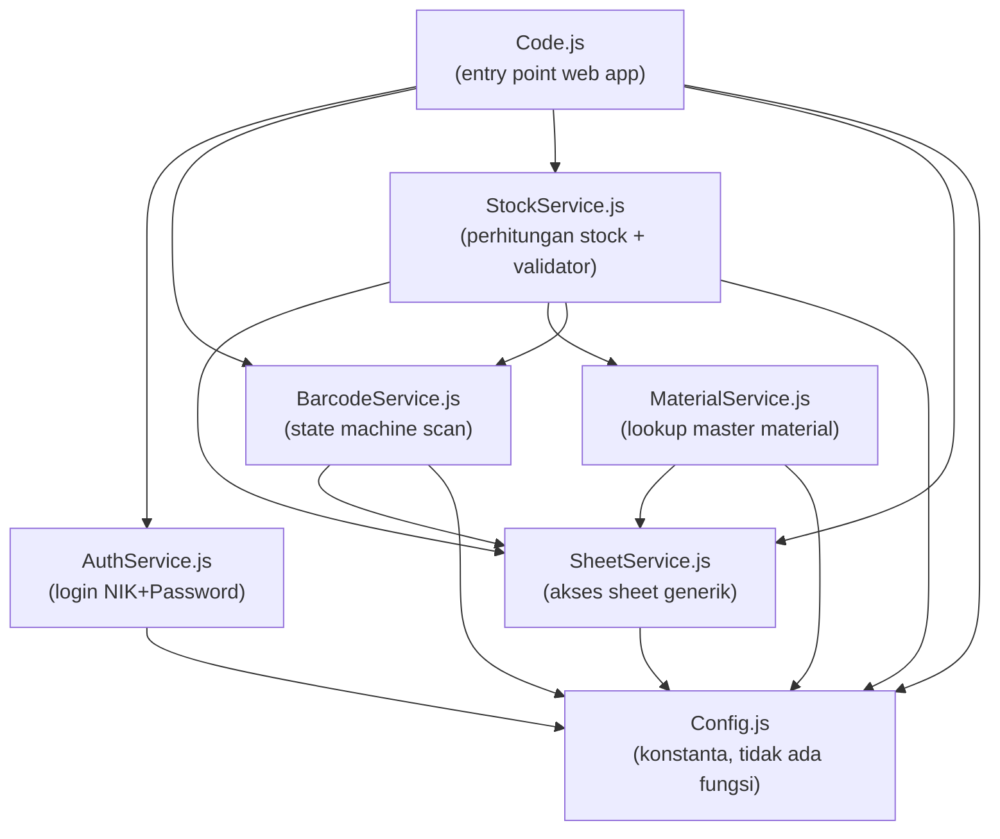
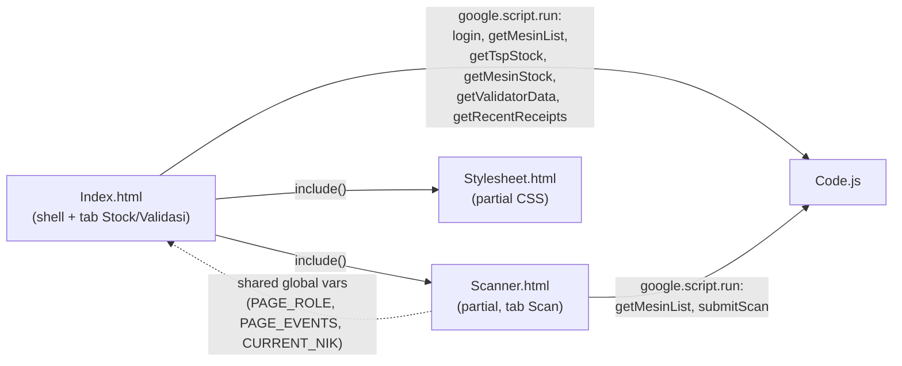
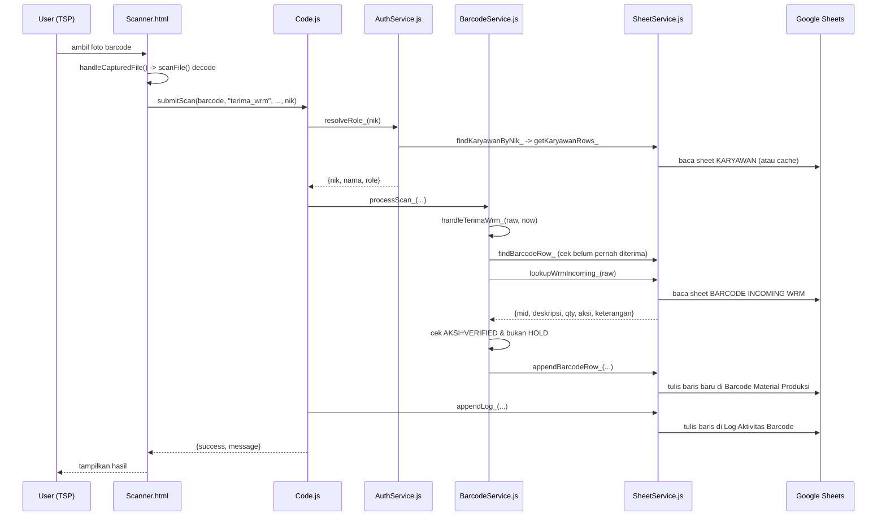
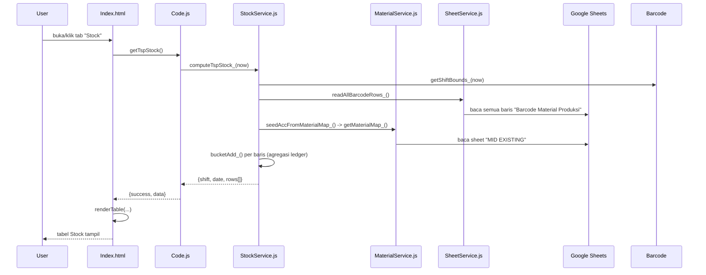

# Dependency Map — TSP Modul

Peta jaringan ketergantungan (siapa memanggil siapa) antar file & fungsi. Apps Script tidak
punya module/import system — semua file `.js` server-side berbagi 1 namespace global, jadi
"dependency" di sini berarti **relasi pemanggilan fungsi**, bukan `import`/`require`.

## 1. Graf Ketergantungan Antar File (Server-Side)



**Urutan lapisan (dari paling dasar ke paling atas):**
1. `Config.js` — konstanta murni, tidak bergantung ke file lain.
2. `SheetService.js` — bergantung ke `Config.js` (nama sheet, kolom).
3. `MaterialService.js`, `AuthService.js` — bergantung ke `SheetService.js`/`Config.js`.
4. `BarcodeService.js` — bergantung ke `SheetService.js`, `Config.js` (state machine EVENTS).
5. `StockService.js` — **paling banyak dependensi**: `SheetService.js`, `MaterialService.js`
   (`getMaterialMap_`), `BarcodeService.js` (`getShiftBounds_`), `Config.js`.
6. `Code.js` — lapisan terluar, orkestrasi semua service di atas jadi entry point yang
   dipanggil client.

## 2. Graf Ketergantungan Client ↔ Server



`Index.html` dan `Scanner.html` dirender jadi **satu dokumen HTML** (lewat `include()`
di `Code.js`), sehingga berbagi 1 scope JavaScript — variabel global yang di-set di
`Index.html` (`PAGE_ROLE`, `PAGE_EVENTS`, `CURRENT_NIK`) langsung terbaca oleh fungsi di
`Scanner.html` tanpa mekanisme passing eksplisit.

## 3. State Machine — Transisi 6 Checkpoint (per 1 barcode)


Catatan: `retur_dari_mesin` prasyaratnya `kirim_mesin` (bukan `terima_operator`), jadi
secara teknis bisa terjadi sebelum ATAU sesudah `terima_operator`/`consume_operator` —
diagram di atas menyederhanakan jadi 1 cabang dari `DikirimMesin` untuk keterbacaan.

## 4. Alur Panggilan — Kasus "Scan Terima dari WRM"



## 5. Alur Panggilan — Kasus "Load Tab Stock"



## 6. Adjacency List (Ringkas, Semua Fungsi Server-Side)

Format: `fungsi -> [daftar fungsi yang dipanggil]`

```
getSheet_ -> [getSpreadsheet_]
ensureSheetsReady_ -> [getSheet_, getSpreadsheet_]
findRowByColumnValue_ -> [getHeaderMap_]
findBarcodeRow_ -> [getSheet_, findRowByColumnValue_]
lookupWrmIncoming_ -> [getSheet_, findRowByColumnValue_]
appendBarcodeRow_ -> [getSheet_, getHeaderMap_]
updateBarcodeCell_ -> [getSheet_, getHeaderMap_]
appendLog_ -> [getSheet_]

getMaterialMap_ -> [getSheet_, getHeaderMap_]
lookupMaterial_ -> [getMaterialMap_]                      # dead code, tidak dipanggil

getKaryawanRows_ -> [readKaryawanRowsFromCache_, writeKaryawanRowsToCache_]
findKaryawanByNik_ -> [getKaryawanRows_]
login_ -> [getLoginAttemptCount_, findKaryawanByNik_, registerLoginFailure_, roleFromJabatan_, clearLoginAttempts_]
resolveRole_ -> [findKaryawanByNik_, roleFromJabatan_]

classifyBarcode_ -> [findBarcodeRow_, getCellValue_]
getNextChildSequence_ -> [getSheet_, getHeaderMap_]
getShift_ -> [getShiftBounds_]
processScan_ -> [ensureSheetsReady_, handleTerimaWrm_, handleKirimMesin_, classifyBarcode_, handleChildCheckpoint_]
handleTerimaWrm_ -> [findBarcodeRow_, lookupWrmIncoming_, formatTimestamp_, getCellValue_, getShift_, appendBarcodeRow_]
handleKirimMesin_ -> [findBarcodeRow_, getCellValue_, getNextChildSequence_, padSeq_, getShift_, appendBarcodeRow_]
handleChildCheckpoint_ -> [findBarcodeRow_, getCellValue_, formatTimestamp_, updateBarcodeCell_]

readAllBarcodeRows_ -> [getSheet_, getHeaderMap_, toDateOrNull_]
seedAccFromMaterialMap_ -> [getMaterialMap_]
computeTspStock_ -> [getShiftBounds_, readAllBarcodeRows_, seedAccFromMaterialMap_, bucketAdd_, formatDateLabel_]
computeMesinStock_ -> [getShiftBounds_, readAllBarcodeRows_, seedAccFromMaterialMap_, bucketAdd_, formatDateLabel_]
computeRecentReceipts_ -> [readAllBarcodeRows_]
computeValidator_ -> [getShiftBounds_, computeTspStock_, getSheet_, parseMb51Timestamp_, getMaterialMap_]

doGet -> [HtmlService.createTemplateFromFile]
login -> [login_]
submitScan -> [resolveRole_, processScan_, appendLog_]
getMesinList -> []                                        # baca MESIN_LIST langsung
getTspStock -> [computeTspStock_]
getMesinStock -> [computeMesinStock_]
getValidatorData -> [computeValidator_]
getRecentReceipts -> [computeRecentReceipts_]
```

## 7. Fungsi "Akar" vs "Daun"

- **Akar panggilan (dipanggil client, tidak dipanggil fungsi server lain)**: semua fungsi
  di `Code.js` (`doGet`, `login`, `submitScan`, `getMesinList`, `getTspStock`,
  `getMesinStock`, `getValidatorData`, `getRecentReceipts`).
- **Daun (tidak memanggil fungsi lain, hanya operasi dasar)**: `getSpreadsheet_`,
  `toDateOrNull_`, `padSeq_`, `formatDateLabel_`, `getLoginAttemptCount_`,
  `clearLoginAttempts_`, `roleFromJabatan_`, `bucketAdd_`, `parseMb51Timestamp_`.
- **Fungsi "hub"** (dipanggil dari banyak tempat, paling kritikal kalau berubah):
  `getSheet_` (dipanggil ~10 fungsi), `getHeaderMap_` (~6 fungsi), `findBarcodeRow_`
  (4 fungsi di BarcodeService.js), `getShiftBounds_` (4 fungsi lintas 2 file).
